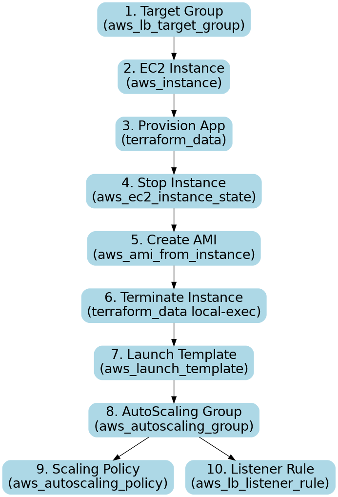

catalogue_terraform_flowchart_vertical.png

# AWS Load Balancer & Target Group - Notes

## 1. Target Group
- Target Group lo **EC2 instances register** untayi.
- Target Group **health check** perform chestundi regularly (example: `/health` path).

## 2. Load Balancer (LB)
- LB **entry point** ga untundi, client requests ni receive chestundi.
- LB **Target Group daggara adugutundi**:
  - “Ee instances lo yavaru healthy unnaru?”

## 3. Target Group response
- **Healthy instances list** → LB ki forward chestundi traffic.
- **Unhealthy instances** → LB ki chepputundi “ee instance unhealthy, traffic matrame ivvaku.”

## ✅ Short Formula / Flow
**LB asks TG → TG tells LB → LB forwards traffic only to healthy EC2s**

## 4. Flowchart Diagram
- **Client → Load Balancer → Target Group → EC2 Instances**
- Health check regular ga TG perform chestundi.
- LB matrame traffic forward chestundi, but TG decides which instances are healthy.

## 5. Sequence for Terraform (Catalogue Component)
1. Create **Target Group** (`aws_lb_target_group`)
2. Create **EC2 instance** (`aws_instance`) and configure app via provisioner
3. Stop instance → take **AMI** → terminate instance
4. Create **Launch Template** (`aws_launch_template`) with that AMI
5. Create **AutoScaling Group** (`aws_autoscaling_group`) attached to target group
6. Attach **Scaling Policy** (`aws_autoscaling_policy`) for CPU based scaling
7. Create **Listener Rule** (`aws_lb_listener_rule`) in ALB

**Visual flow:** TG → EC2 → AMI → LT → ASG → Policy → Listener